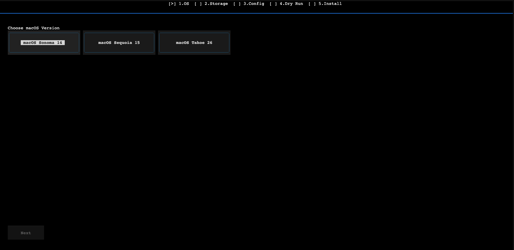
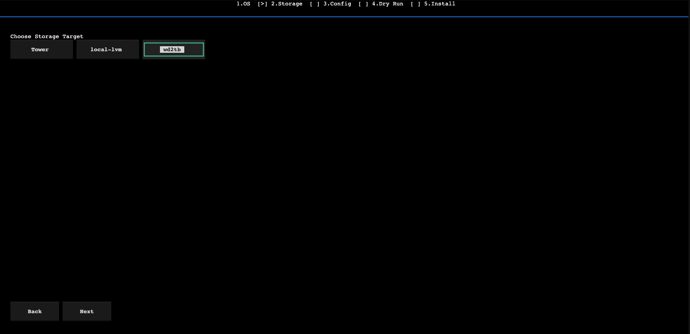
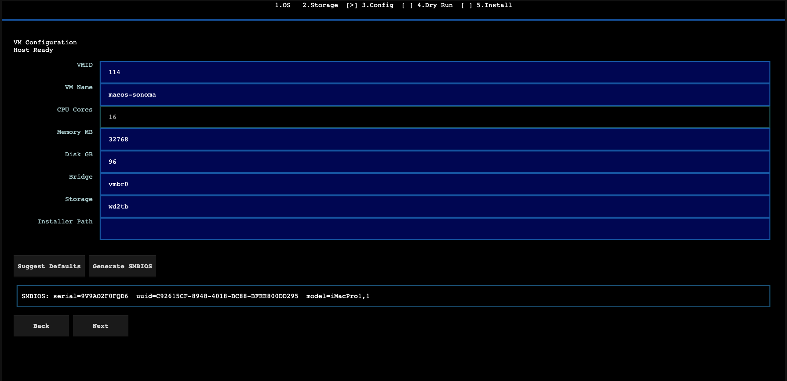
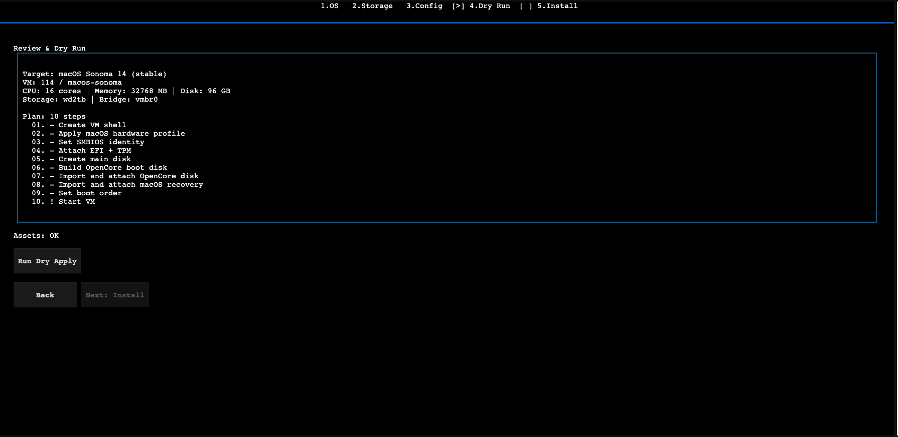

<h1 align="center">
  <br>
  🍏 OSX Proxmox Next
  <br>
</h1>

<p align="center">
  <strong>One-command macOS VM setup for Proxmox 9.</strong><br>
  No manual <code>qm</code> commands. No config file editing. Just a guided wizard.
</p>

<p align="center">
  <a href="https://github.com/wmehanna/osx-proxmox-next">
    
  </a>
  
  <a href="https://ko-fi.com/lucidfabrics">
    
  </a>
  <a href="https://buymeacoffee.com/lucidfabrics">
    
  </a>
</p>

---

## 🧰 What It Does

This tool automates macOS virtual machine creation on Proxmox VE 9. It handles VMID selection, CPU/RAM detection, OpenCore bootloader setup, and the full `qm` command sequence — so you don't have to.

**You get:**
- 🧙 A 6-step TUI wizard: **Preflight > OS > Storage > Config > Dry Run > Install**
- 🔍 Auto-detected hardware defaults (CPU vendor, cores, RAM, storage targets)
- 🖥️ Intel and AMD CPU support — auto-detected, zero configuration needed
- 💿 Automatic OpenCore and recovery/installer download — no manual file placement
- 🆔 Auto-generated SMBIOS identity (serial, UUID, model) — no OpenCore editing needed
- 🍎 Graphical boot picker with Apple icons — auto-boots the installer
- 🛡️ Mandatory dry-run before live install previews every command
- 🚫 Real-time form validation with inline error feedback

### TUI Preview

<table>
  <tr>
    <td align="center">
      <br>
      <strong>Step 1:</strong> OS Selection
    </td>
    <td align="center">
      <br>
      <strong>Step 2:</strong> Storage Selection
    </td>
  </tr>
  <tr>
    <td align="center">
      <br>
      <strong>Step 3:</strong> VM Configuration
    </td>
    <td align="center">
      <br>
      <strong>Step 4:</strong> Review & Dry Run
    </td>
  </tr>
</table>


> **Note:** Dynamic wallpapers are known to not display correctly without GPU passthrough on VNC. Use a static wallpaper instead.

---

## 🚀 Quick Start

Run this on your Proxmox 9 host as root:

```bash
bash -c "$(curl -fsSL https://raw.githubusercontent.com/wmehanna/osx-proxmox-next/main/install.sh)"
```

This clones the repo, sets up a Python venv, and launches the TUI wizard.

> Built solo and maintained in my free time. If it saves you an afternoon of `qm` commands, [a coffee helps](https://ko-fi.com/lucidfabrics) or a [coffee on BMC](https://buymeacoffee.com/lucidfabrics). ☕

### 🐚 Bash Alternative (community-scripts)

Prefer a standalone bash script with no Python dependency? Use the [community-scripts](https://github.com/community-scripts/ProxmoxVE) version:

```bash
bash -c "$(curl -fsSL https://raw.githubusercontent.com/community-scripts/ProxmoxVE/main/vm/macos-vm.sh)"
```

Same VM creation logic (OpenCore + osrecovery + SMBIOS), whiptail menus, no venv needed.

### 🪄 Wizard Walkthrough

| Step | What Happens |
|------|-------------|
| **1️⃣ Preflight** | Auto-detects CPU vendor (Intel/AMD), checks host readiness |
| **2️⃣ Choose OS** | Pick macOS version (Sonoma, Sequoia, Tahoe) — SMBIOS auto-generated |
| **3️⃣ Storage** | Select storage target from auto-detected Proxmox storage pools |
| **4️⃣ Config** | Review/edit VM settings (VMID, cores, memory, disk) with auto-filled defaults |
| **5️⃣ Dry Run** | Auto-downloads missing assets, then previews every `qm` command |
| **6️⃣ Install** | Creates the VM, builds OpenCore, imports disks, and starts the VM |

**Most users:** pick your macOS version, pick your storage, click through to **Install**. Preflight and CPU detection run automatically.

---

## 📋 Requirements

### 🖥️ Hardware

| Component | Minimum | Recommended |
|-----------|---------|-------------|
| 🧠 CPU | 4 cores, VT-x/AMD-V (Intel or AMD) | 8+ cores |
| 💾 RAM | 8 GB host (4 GB to VM) | 16+ GB host |
| 💽 Storage | 64 GB free | 128+ GB SSD/NVMe |
| 🎮 GPU | Integrated | Discrete (for passthrough) |

> **AMD CPUs** are fully supported. The tool auto-detects your CPU vendor and applies the correct configuration (Cascadelake-Server emulation for AMD, native host passthrough for Intel).

### 🏠 Host

- Proxmox VE 9 with root shell access
- Internet access (for bootstrap + dependencies)
- ISO storage available (e.g. `/var/lib/vz/template/iso`)

### ⏱️ TSC Check (Recommended)

Stable TSC flags reduce clock drift and VM lag. Check with:

```bash
lscpu | grep -E 'Model name|Flags'
```

Look for `constant_tsc` and `nonstop_tsc` in the output.

---

## 🍎 Supported macOS Versions

| macOS | Channel | Notes |
|-------|---------|-------|
| **Sonoma 14** | ✅ Stable | Best tested, most reliable |
| **Sequoia 15** | ✅ Stable | Fully supported |
| **Tahoe 26** | ✅ Stable | Fully supported |

---

## ⌨️ CLI Usage

For scripting or headless use, the CLI bypasses the TUI entirely:

```bash
# Download OpenCore + recovery images
osx-next-cli download --macos sonoma

# Check host readiness
osx-next-cli preflight

# Preview commands (dry run) — SMBIOS identity auto-generated
osx-next-cli apply \
  --vmid 910 --name macos-sequoia --macos sequoia \
  --cores 8 --memory 16384 --disk 128 \
  --bridge vmbr0 --storage local-lvm

# Execute for real
osx-next-cli apply --execute \
  --vmid 910 --name macos-sequoia --macos sequoia \
  --cores 8 --memory 16384 --disk 128 \
  --bridge vmbr0 --storage local-lvm

# Enable verbose kernel log (shows text instead of Apple logo during boot)
osx-next-cli apply --execute --verbose-boot \
  --vmid 910 --name macos-sequoia --macos sequoia \
  --cores 8 --memory 16384 --disk 128 \
  --bridge vmbr0 --storage local-lvm

# Skip SMBIOS generation entirely
osx-next-cli apply --no-smbios \
  --vmid 910 --name macos-sequoia --macos sequoia \
  --cores 8 --memory 16384 --disk 128 \
  --bridge vmbr0 --storage local-lvm

# Provide your own SMBIOS values
osx-next-cli apply --execute \
  --vmid 910 --name macos-sequoia --macos sequoia \
  --cores 8 --memory 16384 --disk 128 \
  --bridge vmbr0 --storage local-lvm \
  --smbios-serial C02X1234ABCD --smbios-uuid "$(uuidgen)" \
  --smbios-model iMacPro1,1
```

---

## 🔧 Troubleshooting

<details>
<summary>💽 <strong>macOS installer doesn't show my disk</strong></summary>

In the macOS installer:
1. Open **Disk Utility**
2. Click **View > Show All Devices**
3. Select **QEMU HARDDISK Media**
4. Erase with format **APFS** and scheme **GUID Partition Map**
5. Close Disk Utility and continue installation
</details>

<details>
<summary>🚫 <strong>Live apply is blocked — missing assets</strong></summary>

The tool requires OpenCore and recovery/installer images. It scans `/var/lib/vz/template/iso` and `/mnt/pve/*/template/iso` for:
- `opencore-osx-proxmox-vm.iso` or `opencore-{version}.iso`
- `{version}-recovery.img` or `{version}-recovery.iso`

Use `osx-next-cli download --macos sonoma` to auto-fetch missing assets. The TUI wizard auto-downloads missing assets in step 4.
</details>

<details>
<summary>🐚 <strong>I see UEFI Shell instead of macOS boot</strong></summary>

Boot media path or order mismatch. Ensure OpenCore is on `ide0` and recovery on `ide2`, with boot order set to `ide2;sata0;ide0`.
</details>

<details>
<summary>🖥️ <strong>"Guest has not initialized the display"</strong></summary>

Boot/display profile mismatch during early boot. Use `vga: std` for stable noVNC during installation.
</details>

<details>
<summary>🐢 <strong>macOS is slow on AMD CPU</strong></summary>

Expected behavior. AMD hosts use `Cascadelake-Server` CPU emulation instead of native passthrough (`-cpu host`). This adds overhead but is required for macOS compatibility. Intel hosts get native performance.
</details>

<details>
<summary>🔤 <strong>I want to see verbose kernel log instead of Apple logo</strong></summary>

Use `--verbose-boot` flag in CLI: `osx-next-cli apply --verbose-boot ...`. This adds `-v` to OpenCore boot arguments. Useful for debugging boot issues.
</details>

---

## 🎮 GPU Passthrough

Host-side setup is manual and required before the VM can use a discrete GPU.

1. Enable **VT-d / IOMMU** in BIOS/UEFI
2. Add to kernel cmdline:
   - Intel: `intel_iommu=on iommu=pt`
   - AMD: `amd_iommu=on iommu=pt`
3. Bind GPU + GPU audio to `vfio-pci`
4. Reboot host
5. Attach both PCI functions to VM (`hostpci0`, `hostpci1`)

📖 Reference: [Proxmox PCI(e) Passthrough Wiki](https://pve.proxmox.com/wiki/PCI(e)_Passthrough)

---

## ⚡ Performance Tips

- 💿 Use **SSD/NVMe-backed storage** for VM disks
- 🧠 Don't overcommit host CPU or RAM
- 🔧 Keep the main macOS disk on `sata0`, OpenCore on `ide0`, recovery on `ide2`
- 🖥️ Use `vga: std` during installation (switch after)
- 📏 Change one setting at a time and measure the impact
- ⚡ **Intel CPUs** get native host passthrough — best performance
- 🔄 **AMD CPUs** use Cascadelake-Server emulation — functional but slower due to CPU translation overhead

---

## 🎛️ Guest Performance Profiles (Optional)

These are **optional shell scripts that run inside the macOS guest** to tune responsiveness. They are not part of this project and are not required — use them only if you understand what they change.

### 🔥 Blazing Profile

Optimized for **maximum UI speed** in the VM. Best for general use where you want the snappiest experience.

| What It Changes | Setting |
|----------------|---------|
| 🎞️ UI animations | Disabled (window resize, Mission Control, Dock) |
| 🪟 Transparency effects | Disabled (reduces compositing overhead) |
| 🔎 Spotlight indexing | **Disabled** (`mdutil -a -i off`) — frees CPU/IO |
| 😴 Sleep on AC power | Disabled (sleep, display sleep, disk sleep, Power Nap all off) |
| 🔄 Dock/Finder/SystemUIServer | Restarted to apply changes |

⚠️ **Trade-off:** No Spotlight search (Finder search, Siri suggestions, and in-app search won't index new files).

### 🛠️ Xcode Profile

Optimized for **development workflows** (Xcode, SourceKit, code search). Similar UI optimizations as Blazing, but keeps Spotlight alive.

| What It Changes | Setting |
|----------------|---------|
| 🎞️ UI animations | Disabled (same as Blazing) |
| 🪟 Transparency effects | Disabled (same as Blazing) |
| 🔎 Spotlight indexing | **Kept ON** — required for Xcode code completion and search |
| 😴 System sleep | Disabled, but display sleep is allowed (longer coding sessions) |
| 🔄 Dock/Finder/SystemUIServer | Restarted to apply changes |

⚠️ **Trade-off:** Slightly more background CPU/IO from Spotlight, but Xcode features work fully.

### 🤔 Which Profile Should I Use?

| Use Case | Profile |
|----------|---------|
| 🌐 General browsing, testing apps | **Blazing** |
| 💻 Xcode / SwiftUI / iOS development | **Xcode** |
| 🤷 Don't know / want defaults | **Neither** — skip this section |

### ▶️ Usage

```bash
# Apply blazing profile
bash scripts/profiles/apply_blazing_profile.sh

# Revert to macOS defaults
bash scripts/profiles/revert_blazing_profile.sh

# Apply xcode profile
bash scripts/profiles/apply_xcode_profile.sh

# Revert to macOS defaults
bash scripts/profiles/revert_xcode_profile.sh
```

### 🛡️ Safety Notes

- **Snapshot your VM before applying** any profile
- Apply only one profile at a time
- Always keep the matching `revert_*` script ready
- These scripts accept an optional sudo password argument — avoid storing passwords in plain text

---

## ☁️ Enable Apple Services (iCloud, iMessage, FaceTime)

Apple services require a clean, unique SMBIOS identity and stable network/time configuration.

### 🆔 SMBIOS Identity (Auto-Generated)

This tool **automatically generates** a unique SMBIOS identity (serial, UUID, model) for each VM and applies it via Proxmox's native `--smbios1` flag. No manual OpenCore config editing required.

- **TUI:** SMBIOS is auto-generated when you select a macOS version in step 1. Click **Generate SMBIOS** in step 3 to regenerate.
- **CLI:** SMBIOS is auto-generated unless you pass `--no-smbios` or provide your own values via `--smbios-serial`, `--smbios-uuid`, `--smbios-model`.

The generated values are visible in the dry-run output as a `qm set --smbios1` step.

### 📝 Additional Setup for Apple Services

1. **Verify** NVRAM is writable and persists across reboots
2. **Boot macOS** and confirm date/time are correct and network/DNS works
3. **Sign in order:** Apple ID (System Settings) first, then Messages, then FaceTime
4. **Reboot** once after login to confirm session persistence

### ✅ Checklist

- [x] SMBIOS values are unique to this VM (auto-generated)
- [ ] MAC address is stable (not regenerated each boot)
- [ ] Same OpenCore EFI is always used
- [ ] NVRAM reset is not triggered on every boot

### 🩺 Common Issues

| Problem | Fix |
|---------|-----|
| "This Mac cannot connect to iCloud" | Recheck serial/MLB/UUID/ROM uniqueness. Sign out, reboot, sign in again. |
| "iMessage activation failed" | Verify ROM format and stable MAC mapping. Check date/time sync. |
| Works once then breaks | VM config is regenerating SMBIOS or NIC MAC between boots. |

> **Important:** Never share SMBIOS values publicly or reuse them across VMs. Apple controls service activation and it can still fail even with correct setup.

---

## 📂 Project Layout

```
src/osx_proxmox_next/
  app.py          # TUI wizard (Textual) — 5-step reactive state machine
  cli.py          # Non-interactive CLI
  domain.py       # VM config model + validation
  planner.py      # qm command generation
  executor.py     # Dry-run and live execution engine
  assets.py       # OpenCore/installer ISO detection
  downloader.py   # Auto-download OpenCore + recovery images
  defaults.py     # Host-aware hardware defaults
  preflight.py    # Host capability checks
  rollback.py     # VM snapshot/rollback hints
  smbios.py       # SMBIOS identity generation (serial, UUID, model)
  profiles.py     # VM config profile management
  infrastructure.py # Proxmox command adapter
```

---

## 🪝 Git Hooks

```bash
bash scripts/setup-hooks.sh
```

Enables pre-commit, commit-msg, and pre-push hooks for:
- **Commit message validation** — enforces [conventional commits](https://www.conventionalcommits.org/) format
- **Secret detection** — blocks hardcoded passwords, API keys, tokens
- **Code quality warnings** — flags TODO/FIXME and debug `print()` statements

---

## 🔮 Roadmap

- 🧩 **Multi-VM templates** — save and reuse configurations across VMs
- 🔄 **Auto-update OpenCore** — detect and pull latest OpenCore releases
- 🎮 **GPU passthrough wizard** — guided IOMMU + VFIO setup *(unlocks at 20 sponsors)*

---

## 💖 Supporters

This project is free and open source. Sponsors keep it alive and shape what gets built next.

<p align="center">
  <a href="https://github.com/sponsors/lucid-fabrics">
    
  </a>
  &nbsp;
  <a href="https://buymeacoffee.com/lucidfabrics">
    
  </a>
  &nbsp;
  <a href="https://ko-fi.com/lucidfabrics">
    
  </a>
</p>

**Sponsors:**
- ❤️ [SuperDooper](https://github.com/superdooper86)

---

## ⚖️ Disclaimer

This project is for **testing, lab use, and learning**. Respect Apple licensing and intellectual property. You are responsible for legal and compliance use in your region.

---

<p align="center">
  This project is built and maintained solo. No company, no team — just one dev who got tired of manual <code>qm</code> configs.<br>
  If it saved you time, a coffee keeps it going:<br><br>
  <a href="https://ko-fi.com/lucidfabrics">
    
  </a>
  &nbsp;&nbsp;
  <a href="https://github.com/sponsors/lucid-fabrics">
    
  </a>
  &nbsp;&nbsp;
  <a href="https://buymeacoffee.com/lucidfabrics">
    
  </a>
  <br><br>
  ⭐ <a href="https://github.com/lucid-fabrics/osx-proxmox-next">Star this repo</a> to help others find it.
</p>
